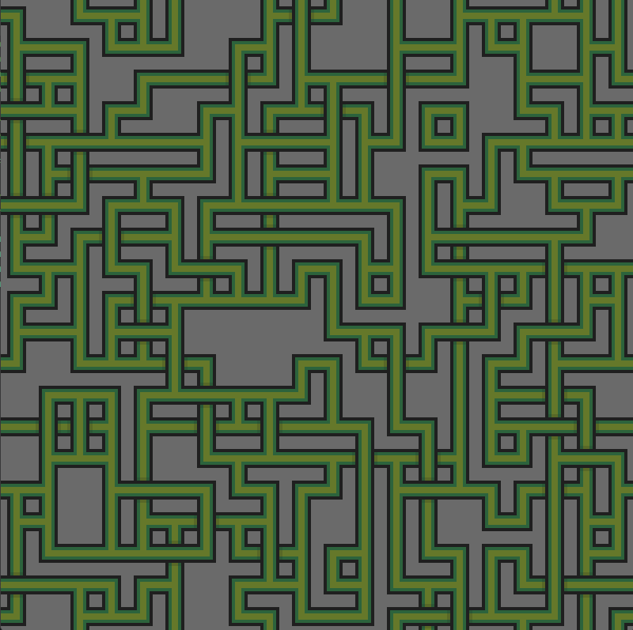
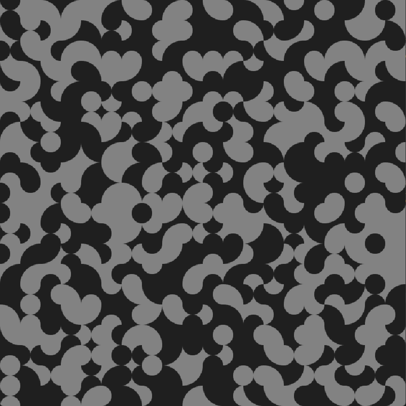
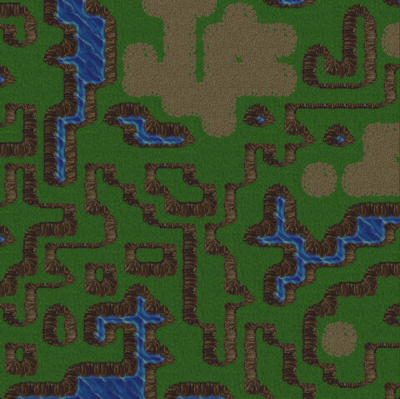

Wave Function Collapse Algorithm in Python

This project automatically generates a grid of cells, each cell has a sprite that connects with the neighboring cells using the wave function collapse algorithm, that removes certain possibilities from the uncollapsed cell based on the neighboring cells collapse.

The Summer and the Rooms tilesets are still WIP, but the others produce some nice results.

Tiles from: https://github.com/mxgmn/WaveFunctionCollapse
